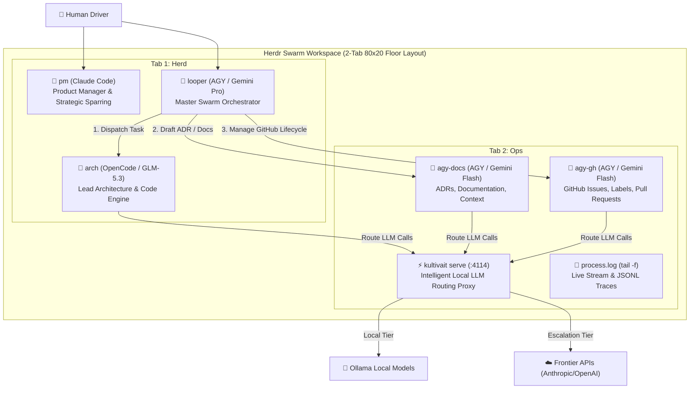

# Herdr Loop Swarm (`loop-bot-herd-agy`)

> Autonomous Multi-Agent Orchestration Swarm powered by **Herdr**, **AGY (Gemini)**, **Claude Code**, **OpenCode (GLM-5.3)**, and **Kultivait Local Routing Proxy**.

---

## Architecture Overview



---

## Major Workflow Improvements Implemented

1. **Deterministic Sentinel Handshakes & Structured Summaries**:
   - Rather than fragile terminal line scraping, workers write structured completion summaries (`/tmp/arch-out.md`, `/tmp/agy-docs-out.md`) with explicit commit SHAs and test statistics.
2. **Universal Project Auto-Detection**:
   - Automatically inspects the current repository and detects the build tool and test runner (`uv run pytest`, `cargo test`, `npm/pnpm/yarn test`, `go test`).
3. **Native Kultivait Routing Proxy Dogfooding**:
   - Spawns and configures `kultivait serve` on `:4114` within the Ops tab, allowing every agent in the herd to route through Kultivait for zero-cost local classification and time/savings ledgers.
4. **Structured JSONL Telemetry (`lib/telemetry.py`)**:
   - Records machine-readable event traces to `~/.herdr-loop-swarm/traces/<session_id>.jsonl` tracking prompt dispatch times, status transitions, test results, and token costs.
5. **Circuit Breakers & Health Watchdog (`lib/agent_guard.sh`)**:
   - Monitors agent health states (`idle`, `working`, `blocked`, `done`), detecting rate-limit or stalling events before timeouts deadlock the loop.
6. **Self-Healing Multi-Tab 80×20 Geometry Floor (`lib/layout_engine.sh`)**:
   - Enforces a minimum legible terminal size (80 columns × 20 rows) and automatically relocates cramped splits into dedicated tabs without breaking agent attachments.

---

## Quickstart

Run directly from any project directory (internal or external terminal):

```bash
# Launch interactive wizard
~/fun/loop-bot-herd-agy/herdr-loop-swarm.sh
```

### Modes Supported:
- `w` — **Wayfinder Map**: Interactive milestone charting with `arch`
- `b` — **Brainstorm**: Rapid PRD and ticket decomposition
- `r` — **Resume Map**: Automatically drain an active Wayfinder Map issue
- `a` — **Auto-Queue**: Continuous loop pulling unblocked backlog tickets
- `s` — **Seat Only**: Initialize all panes and standing briefs without kickoff

---

## File Structure

```
~/fun/loop-bot-herd-agy/
├── herdr-loop-swarm.sh     # Master executable launcher & wizard
├── swarm.config.toml       # Declarative agent seats & proxy config
├── README.md               # Architecture guide & documentation
├── briefs/                 # Upgraded standing agent briefs
│   ├── looper.md           # Master orchestrator brief (Preamble rule)
│   ├── arch.md             # Lead architect & code engine (GLM-5.3)
│   ├── worker-docs.md      # ADR & documentation specialist (Flash)
│   ├── worker-gh.md        # GitHub & CI operations specialist (Flash)
│   ├── overseer-pm.md      # Claude Code PM & strategic advisor
│   └── reviewer.md         # Optional code & security reviewer
└── lib/                    # Modular engine libraries
    ├── layout_engine.sh    # Multi-tab layout & 80x20 floor manager
    ├── agent_guard.sh      # Health watchdog & circuit breakers
    └── telemetry.py        # Structured JSONL event logger
```
