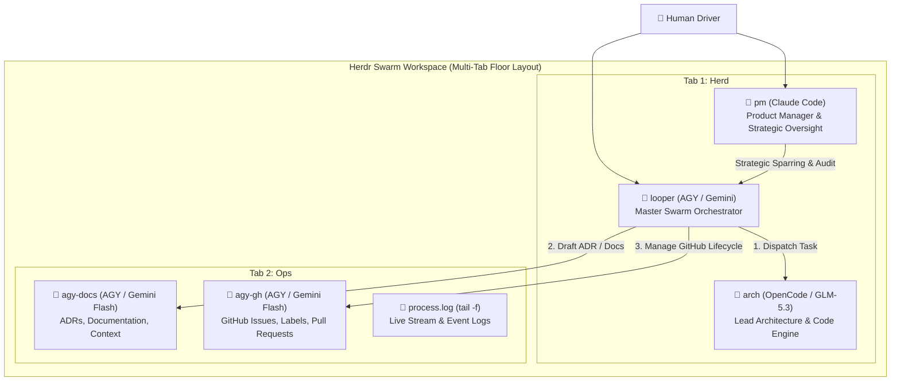

# Herdr Loop Swarm (`loop-bot-herd-agy`)

> Autonomous Multi-Agent Orchestration Swarm powered by **Herdr**, **AGY (Gemini)**, **Claude Code**, **OpenCode (GLM-5.3)**, and fail-closed quality gates.

---

## Architecture Overview



---

## Shipped Core Capabilities

1. **Fail-Closed Project Profiling (`lib/profile.sh`)**:
   - Inspects the active repository to detect ecosystem (Python, Rust, Node, Go) and canonical remote.
   - **Fail-Closed Guarantee**: Never defaults to hardcoded repositories or fake-green `true` test runners. Interactive prompt re-prompts until explicit non-empty input is received. Auto-queue mode aborts if tests are unrunnable.
2. **Deterministic Workspace Lifecycle & Safe Teardown (`lib/lifecycle.sh`)**:
   - `find_workspace_by_cwd` strictly keys workspaces by physical directory CWD (resolving symlinks and inspecting pane CWDs).
   - Safe `down` routine records and closes exclusively herd-seated panes recorded in `.herdr-swarm/seats.json`, preserving external operator panes and enforcing confirmation gates.
3. **Supervisor Re-Verdict Deduplication Protocol (`loop-bot-herd.sh`)**:
   - Completion verdicts use the explicit `ARCH DONE #<ticket> <commit-sha>` protocol.
   - Supervisor deduplicates on `(ticket, sha)` via `jq`, ensuring that bugfixes committed after a `RED` test failure are automatically re-evaluated through the test gate.
4. **Shared Slug Sanitizer & Shell-Safe Emitter (`lib/common.sh`, `lib/config.sh`)**:
   - `slugify()` normalizes project names into Herdr-compliant agent identifiers (`^[a-z][a-z0-9_-]*$`).
   - `config_dump_env` passes parameters via `sys.argv` and quotes environment variable exports safely with Python's `shlex.quote`.
5. **9-Point Preflight Validation Matrix (`lib/preflight.sh`)**:
   - Validates Herdr daemon responsiveness, essential CLIs (`git`, `jq`, `gh`, `python3`+`tomllib`), and agent binaries (`agy`, `claude`, `opencode`) before any panes or workspaces are created.
6. **Templated Briefs & Compact Delivery Protocol (`lib/briefs.sh`, `briefs/*.in.md`)**:
   - Dynamic templates substitute repository facts (`{{REPO}}`, `{{TEST_CMD}}`, `{{SLUG}}`) into `.herdr-swarm/briefs/`, delivering instructions via file path rather than massive prompt strings.
7. **Geometry Guard Floor (`lib/layout_engine.sh`)**:
   - Enforces minimum terminal geometry (80 columns × 20 rows), automatically relocating cramped splits into dedicated tabs.

---

## Quickstart

Run directly from any project directory:

```bash
# Launch swarm orchestrator
./herdr-loop-swarm.sh
```

### Modes Supported:
- `w` — **Wayfinder Map**: Interactive milestone charting with `arch`
- `b` — **Brainstorm**: Rapid PRD and ticket decomposition
- `r` — **Resume Map**: Automatically drain an active Wayfinder Map issue
- `a` — **Auto-Queue**: Continuous loop pulling unblocked backlog tickets (fail-closed if `TEST_CMD` is not runnable)
- `s` — **Seat Only**: Initialize topology and deliver standing briefs without auto-dispatch

---

## Repository Structure

```
loop-bot-herd-agy/
├── herdr-loop-swarm.sh     # Master executable launcher & wizard
├── loop-bot-herd.sh        # Background supervisor & suite test gate
├── swarm.config.toml       # Declarative agent seats & swarm configuration
├── README.md               # Architecture guide & documentation
├── STATE.md                # Real-time state & checkpoint ledger
├── briefs/                 # Standing agent briefs & input templates
│   ├── looper.md           # Master orchestrator brief (Preamble rule)
│   ├── arch.in.md          # Lead architect & code engine template (GLM-5.3)
│   ├── worker-docs.in.md   # ADR & documentation specialist template (Flash)
│   ├── worker-gh.in.md     # GitHub & CI operations specialist template (Flash)
│   ├── overseer-pm.in.md   # Claude Code PM strategic overseer template
│   └── reviewer.in.md      # Code & security reviewer template
├── lib/                    # Modular swarm libraries
│   ├── common.sh           # Shared utilities & slugify() normalizer
│   ├── profile.sh          # Universal project profiling & fail-closed test gate
│   ├── lifecycle.sh        # Workspace lookup by CWD & safe teardown
│   ├── preflight.sh        # 9-point preflight dependency & daemon verification
│   ├── config.sh           # TOML parser & safe shlex argv emitter
│   ├── briefs.sh           # Template renderer & brief delivery engine
│   └── layout_engine.sh    # Multi-tab layout & 80x20 geometry guard floor
├── maps/                   # Wayfinder maps & ticket ledgers
│   ├── universal-herdr-swarm.md  # Plan of record
│   └── tickets/            # Granular milestone tickets
└── docs/                   # Audits, findings & reordered execution plans
```
