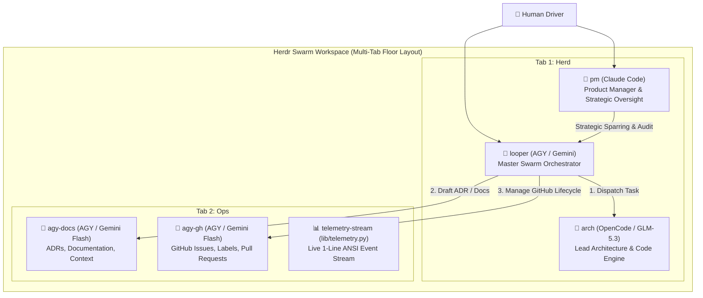

# Stampede

**Zero Trust for LLM compute nodes.**

A coding agent is an untrusted worker that will optimize for the laziest path to
a green build. Stampede seats a herd of them against your repository and refuses
to take their word for anything.

Every claim of "done" is an unverified assertion until an independent supervisor
re-runs your real test suite against the exact commit — in the exact tree that
produced it. Implementation agents work in isolated worktrees and never merge.
Green verdicts are queued for an arbiter, which re-tests the *combined* result
before advancing an integration ref by compare-and-swap. Only a human moves
`main`.

The result is a system that systematically neutralizes the AI equivalent of
gaming the CI pipeline. It costs more compute than trusting the agent. That is
the trade.

> **Scope note:** The worktree gate and arbiter pipeline cover implementation
> seats (`arch-*`, `pi`). Documentation and coordination seats (`looper`,
> `pm`, `agy-docs`, `agy-gh`) commit directly to the base branch; their work
> is reviewed by a human before `main` advances.

---

## Architecture Overview



The swarm operates in a dedicated, multi-tab Herdr workspace:
- **Tab 1 (`Herd`)**: Hosts the primary execution trio — `pm` (strategic overseer), `arch` (lead implementation engine), and `looper` (master coordinator and test verifier).
- **Tab 2 (`Ops`)**: Hosts operational support agents (`agy-docs` for documentation and ADRs, `agy-gh` for GitHub issue management) and the **Ops Anchor Pane**, which runs [`lib/telemetry.py`](lib/telemetry.py) streaming real-time, terminal-width clamped ANSI badges (`DISPATCH`, `VERDICT:✓/✗`, `BREAKER:⚠`, `LIFECYCLE`, `VERIFY:✓/✗`) directly from `.herdr-swarm/traces/`.

---

## Shipped Core Capabilities

1. **Fail-Closed Project Profiling & Test Gate ([`lib/profile.sh`](lib/profile.sh), [ADR 0001](docs/adr/0001-fail-closed-profile-and-test-gating.md))**:
   - Inspects target repository manifests to auto-detect toolchains (Python/uv/pytest, Rust/cargo, Node/pnpm/npm, Go) and GitHub remotes without hardcoded defaults.
   - **Fail-Closed Invariant**: Rejects synthetic test bypasses (`TEST_CMD="true"`). Auto-queue mode aborts immediately if no runnable test runner is configured.
2. **Supervisor Re-Verdict Deduplication Protocol ([`loop-bot-herd.sh`](loop-bot-herd.sh), [ADR 0002](docs/adr/0002-exact-sha-supervisor-deduplication.md))**:
   - Completion signals adhere to the `ARCH DONE #<ticket> <commit-sha>` protocol.
   - Supervisor uses `jq` to deduplicate on exact `(ticket, sha)` tuples, eliminating `#23` vs `#230` substring collisions and enabling self-healing fix-and-reverdict loops on new commits after `RED` test failures.
3. **Dynamic TOML Seating & Slug Namespacing ([`swarm.config.toml`](swarm.config.toml), [`lib/config.sh`](lib/config.sh), [ADR 0003](docs/adr/0003-dynamic-seating-and-nonce-brief-delivery.md))**:
   - Declarative seat registry in `swarm.config.toml` dynamically parsed via Python `tomllib`.
   - `slugify()` normalizes project directories into Herdr-compliant agent identifiers (`seat-<slug>` matching `^[a-z][a-z0-9_-]*$`), enabling multiple swarms to run concurrently without agent name collisions.
4. **Nonce Brief Delivery Protocol ([`lib/briefs.sh`](lib/briefs.sh), [ADR 0003](docs/adr/0003-dynamic-seating-and-nonce-brief-delivery.md))**:
   - Renders brief templates (`briefs/*.in.md`) to disk with project variables, delivering instructions via ultra-compact (<200 bytes) file pointers. Eliminates PTY buffer overflow and corrupted prompt injections.
5. **Deterministic Workspace Lifecycle & Durable Seat Ledger ([`lib/lifecycle.sh`](lib/lifecycle.sh), [ADR 0004](docs/adr/0004-safe-workspace-lifecycle-and-seat-ledger.md))**:
   - `find_workspace_by_cwd` resolves workspaces strictly by matching physical pane working directories.
   - Durably tracks seated agents in `.herdr-swarm/seats.json`, retiring only swarm-managed panes while preserving human operator shells and dev servers.
6. **9-Point Preflight Dependency Matrix ([`lib/preflight.sh`](lib/preflight.sh), [ADR 0005](docs/adr/0005-preflight-matrix-and-seat-verification.md))**:
   - Validates daemon liveness, core utilities (`jq`, `git`, `python3`+`tomllib`, `gh`), GitHub authentication, and agent runtimes before any workspace mutation begins.
7. **Post-Seating Readiness Verification Gate ([`lib/lifecycle.sh`](lib/lifecycle.sh), [ADR 0005](docs/adr/0005-preflight-matrix-and-seat-verification.md))**:
   - `swarm_verify_seats` actively polls all seated agents until they settle into `idle` or `done` states after ingesting their briefs, preventing race conditions before kickoff task prompts dispatch.
8. **Real-Time ANSI Telemetry Engine ([`lib/telemetry.py`](lib/telemetry.py))**:
   - Structured JSONL event logging and live stream renderer displaying color-coded status badges clamped to terminal width in the Ops pane.

---

## Phase 2 Architecture: Parallel Worktree Isolation

Milestone 1 shipped a hardened, fail-closed sequential swarm where all agents operate in the root repository checkout (`$PWD`). **Phase 2** expands this foundation into a **concurrent, parallel worker swarm** powered by Git worktrees.

### 1. Concurrency Resilience (0/240 Empirical Benchmark)
In sequential herds where multiple agents share a single working checkout, concurrent `git add` and `git commit` operations frequently collide: empirical probes in the [Phase 2 PM Worktree Advisory](docs/audits/2026-09-19-phase2-worktree-advisory.md) measured a **4/6 failure rate (`index.lock: File exists`)** under shared-checkout conditions.

By provisioning isolated Git worktrees (`git worktree add`) for each autonomous coding agent:
- **0/240 failures** across 20 rounds of parallel commits by 12 concurrent workers.
- **100% clean `git fsck`** verification with zero index corruption or lost commits.
- **Independent Index & HEAD**: Each worker operates with its own index and branch ref, eliminating lock contention.

### 2. Floor Topology & Lifecycle
- **Root Anchor Workspace (`$PWD`)**: `looper` (master orchestrator), `pm` (strategic overseer), and `telemetry-stream` (Ops anchor pane) remain anchored in the primary checkout on `main`.
- **Isolated Worker Worktrees**: Dedicated worker directories (`.herdr-swarm/worktrees/<seat>`) checkout private task branches (`swarm/<slug>/<seat>`), sharing the underlying `.git` object database.
- **Durable State Accounting**: `.herdr-swarm/seats.json` tracks `"worktree_dir"` and `"branch"` per seat.
- **Safe Lifecycle Teardown**: `swarm_down` prunes exclusively registered disposable worktrees (`git worktree remove --force`), preserving the root tree and leaving worker branch commits intact in Git history.
- **Lifecycle Dogfooding Receipt**: Validated in the [Dogfooding Rehearsal Receipt](docs/audits/2026-09-19-dogfooding-rehearsal-receipt.md), verifying multi-workspace isolation (`status` → `up` → `verify` → `down`) without host workspace hijacking.

For comprehensive architectural design and technical specifications, see:
- [ADR 0006: Git Worktree Worker Isolation and Lifecycle Management](docs/adr/0006-git-worktree-worker-isolation.md)
- [Phase 2 Specification: docs/worktree-swarm.md](docs/worktree-swarm.md)
- [Phase 2 Advisory: Concurrency Hazards & Ledger v2](docs/audits/2026-09-19-phase2-worktree-advisory.md)
- [Dogfooding Rehearsal Receipt: End-to-End Swarm Lifecycle](docs/audits/2026-09-19-dogfooding-rehearsal-receipt.md)

---

## CLI Usage and Subcommands

The public entry point is [`bin/stampede`](bin/stampede):

```bash
bin/stampede <command> [args]
```

Lifecycle commands (`up`, `down`, `status`, `verify`, and bare invocation)
delegate by `exec` to the launcher below — behaviour is identical however
you call it. Any other command dispatches by convention: a file at
`lib/cli/stampede-<cmd>.sh` defining `stampede_cmd_<cmd>()` becomes the
`stampede <cmd>` subcommand, no dispatcher edit required. Unknown commands
print usage and exit `1`.

The underlying scripts remain valid entry points:

```bash
./herdr-loop-swarm.sh [up] [OPTIONS] | status [dir] | down [dir] [FLAGS] | verify [dir] [timeout_ms]
```

### 1. `up` (Default) — Launch or Re-attach Swarm
Initializes the workspace, runs preflight verification, configures profiling, seats agents, verifies readiness, and dispatches initial tasks.

```bash
./herdr-loop-swarm.sh [up] [dir] [OPTIONS]
```

**Options**:
- `-m, --mode <w|b|r|a|s>`: Swarm operational mode:
  - `w` — **Wayfinder Map**: Interactive milestone charting with `arch`
  - `b` — **Brainstorm**: Rapid PRD and ticket decomposition
  - `r` — **Resume Map**: Automatically drain an active Wayfinder Map issue
  - `a` — **Auto-Queue**: Continuous autonomous loop pulling unblocked backlog tickets (fail-closed if tests unrunnable)
  - `s` — **Seat Only**: Initialize topology, render briefs, and verify readiness without auto-dispatching work
- `-n, --map <NUM>`: Map issue number to resume (for mode `r`)
- `-t, --topic <DESC>`: Milestone description or brainstorm topic (for modes `w` or `b`)
- `-s, --seat-only`: Shorthand for `--mode s`
- `-h, --help`: Display CLI usage and help

### 2. `status` — Swarm State and Observability Inspection
Inspects the active Herdr workspace, seated agents, detected profile, test suite configuration, and recent trace events for a target directory (defaults to `$PWD`):

```bash
./herdr-loop-swarm.sh status [dir]
```

### 3. `down` — Non-Destructive Selective Teardown
Gracefully retires seated agent processes by reading `.herdr-swarm/seats.json`, closing exclusively swarm-allocated panes while protecting operator panes, and preserving audit logs:

```bash
./herdr-loop-swarm.sh down [dir] [-y|--yes] [--keep-ws|--keep-workspace]
```

**Flags**:
- `-y, --yes`: Bypass interactive confirmation prompt (required for non-interactive scripting)
- `--keep-ws, --keep-workspace`: Close only swarm seat panes, keeping the Herdr workspace container and operator shells open

### 4. `verify` — Post-Seating Readiness Verification Gate
Asserts that every agent defined in `.herdr-swarm/seats.json` is alive, responsive, and has completed reading its standing brief:

```bash
./herdr-loop-swarm.sh verify [dir] [timeout_ms]
```
- Exits `0` if all seats reach `idle` or `done` within `timeout_ms` (default: 30,000 ms).
- Exits non-zero (`1`) if any agent times out, crashes, or is missing.

---

## Seat Verification and Fail-Closed Guarantees

Seating agents inside terminal multiplexers is fundamentally asynchronous. Spawning an LLM agent process requires time to load model configurations, initialize tools, and ingest standing briefs. 

To prevent **kickoff race conditions** (where task prompts arrive while an agent is still booting), the swarm enforces the `swarm_verify_seats` protocol:

1. **Roster Lookup**: Inspects `.herdr-swarm/seats.json` (or live workspace agents).
2. **Readiness Probe**: For each seat, issues:
   ```bash
   herdr agent wait "$name" --until "idle" --until "done" --timeout "$timeout_ms"
   ```
3. **Fail-Closed Autonomous Gate**:
   - In interactive mode (`s`), warnings are printed for unready seats.
   - In autonomous queue mode (`a`), the launcher **fails closed** and aborts execution immediately if core implementation seats (`arch`, `pm`) fail to settle, ensuring tasks are never dispatched into void panes.

---

## System Vocabulary and Architecture Decisions

- **System Vocabulary & Invariants**: See [`CONTEXT.md`](CONTEXT.md) for definitions of foundational concepts (**Fail-Closed**, **Nonce Delivery**, **Seat Ledger**, **Slug Namespacing**, **Suite Gate**, **Wayfinder Map**, **Supervisor Gate**) and explicit `_Avoid_` warnings.
- **Architecture Decision Records (ADRs)**: See [`docs/adr/`](docs/adr/README.md) for full decision histories:
  - [ADR 0001: Fail-Closed Profile Detection and Test Gating Policy](docs/adr/0001-fail-closed-profile-and-test-gating.md)
  - [ADR 0002: Exact-SHA Supervisor Protocol and Re-Verdict Deduplication](docs/adr/0002-exact-sha-supervisor-deduplication.md)
  - [ADR 0003: Dynamic Seating from TOML Registry and Nonce Brief Delivery Protocol](docs/adr/0003-dynamic-seating-and-nonce-brief-delivery.md)
  - [ADR 0004: Safe Workspace Lifecycle, Physical CWD Resolution, and Seat Ledger](docs/adr/0004-safe-workspace-lifecycle-and-seat-ledger.md)
  - [ADR 0005: Preflight Dependency Matrix and Post-Seating Readiness Verification Gate](docs/adr/0005-preflight-matrix-and-seat-verification.md)
  - [ADR 0006: Git Worktree Worker Isolation and Lifecycle Management](docs/adr/0006-git-worktree-worker-isolation.md)
  - [ADR 0007: Split-Pane CWD Ordering, Stale Branch Safety, and Durable Seat Ledger v2](docs/adr/0007-split-pane-cwd-order-and-ledger-v2.md)
  - [ADR 0008: Supervisor Worktree Suite Gating, Provenance, and Drift Detection](docs/adr/0008-supervisor-worktree-suite-gating-and-drift.md)
  - [ADR 0009: Arbiter Branch Integration, Compare-and-Swap Ref Updates, and Human Promotion Gates](docs/adr/0009-arbiter-branch-integration-and-cas-merge.md)
  - [ADR 0010: Worktree Teardown Lifecycle, Untracked File Salvage, and Stale Branch Re-attachment Gating](docs/adr/0010-worktree-teardown-lifecycle-and-salvage.md)
  - [ADR 0011: Multi-Worker Floor Topologies, Worktree Namespacing, and Heterogeneous Concurrency](docs/adr/0011-multi-worker-floor-topologies-and-concurrency.md)
  - [ADR 0012: Task Partitioning, File Disjointness, and Durable Ledger Leases](docs/adr/0012-task-partitioning-and-disjoint-dispatches.md)
  - [ADR 0013: Asynchronous Supervisor Suite Gating, Durable Job Records, and Concurrency Bounding](docs/adr/0013-asynchronous-supervisor-gate-jobs.md)
- **Swarm Orchestration Retrospective**: See [`docs/findings/swarm-orchestration-retrospective.md`](docs/findings/swarm-orchestration-retrospective.md).
- **Phase 2 Worktree Architecture Blueprint**: See [`docs/worktree-swarm.md`](docs/worktree-swarm.md).
- **Dogfooding Rehearsal Receipt**: See [`docs/audits/2026-09-19-dogfooding-rehearsal-receipt.md`](docs/audits/2026-09-19-dogfooding-rehearsal-receipt.md).
- **Wayfinder Architecture Plan**: See [`maps/universal-herdr-swarm.md`](maps/universal-herdr-swarm.md) and [`maps/tickets/`](maps/tickets).

---

## Repository Structure

```
stampede/
├── herdr-loop-swarm.sh     # Master universal executable launcher & CLI
├── loop-bot-herd.sh        # Background supervisor daemon & exact-SHA suite gate
├── swarm.config.toml       # Declarative agent seats & swarm configuration
├── CONTEXT.md              # System vocabulary, invariants & _Avoid_ warnings
├── README.md               # User guide, CLI documentation & architecture
├── STATE.md                # Real-time state & checkpoint ledger
├── briefs/                 # Standing agent brief templates & master prompts
│   ├── looper.md           # Master orchestrator brief (3-line preamble rule)
│   ├── arch.in.md          # Lead architect & code engine template (GLM-5.3)
│   ├── worker-docs.in.md   # ADR & documentation specialist template (Flash)
│   ├── worker-gh.in.md     # GitHub & CI operations specialist template (Flash)
│   ├── overseer-pm.in.md   # Claude Code PM strategic overseer template
│   └── reviewer.in.md      # Code & security reviewer template
├── lib/                    # Modular swarm libraries & engines
│   ├── common.sh           # Shared utilities & slugify() normalizer
│   ├── profile.sh          # Universal project profiling & fail-closed test gate
│   ├── lifecycle.sh        # Workspace CWD lookup, safe down & verify_seats gate
│   ├── preflight.sh        # 9-point preflight dependency & daemon verification
│   ├── config.sh           # TOML parser & safe shlex argv emitter
│   ├── briefs.sh           # Template renderer & nonce delivery engine
│   ├── telemetry.py        # Structured JSONL event logging & live ANSI badge stream
│   └── layout_engine.sh    # Multi-tab layout & 80x20 geometry guard floor
├── maps/                   # Wayfinder maps & ticket ledgers
│   ├── universal-herdr-swarm.md  # Master destination plan
│   └── tickets/            # Granular milestone prototype tickets
└── docs/                   # ADRs, findings & audit archives
    ├── worktree-swarm.md   # Phase 2 Worktree Architecture Blueprint
    ├── adr/                # Architecture Decision Records (0001–0013)
    │   ├── README.md       # ADR catalog & index
    │   ├── 0001-fail-closed-profile-and-test-gating.md
    │   ├── 0002-exact-sha-supervisor-deduplication.md
    │   ├── 0003-dynamic-seating-and-nonce-brief-delivery.md
    │   ├── 0004-safe-workspace-lifecycle-and-seat-ledger.md
    │   ├── 0005-preflight-matrix-and-seat-verification.md
    │   ├── 0006-git-worktree-worker-isolation.md
    │   ├── 0007-split-pane-cwd-order-and-ledger-v2.md
    │   ├── 0008-supervisor-worktree-suite-gating-and-drift.md
    │   ├── 0009-arbiter-branch-integration-and-cas-merge.md
    │   ├── 0010-worktree-teardown-lifecycle-and-salvage.md
    │   ├── 0011-multi-worker-floor-topologies-and-concurrency.md
    │   ├── 0012-task-partitioning-and-disjoint-dispatches.md
    │   └── 0013-asynchronous-supervisor-gate-jobs.md
    ├── findings/           # Empirical semantics, schemas, and retrospective
    │   └── swarm-orchestration-retrospective.md
    └── audits/             # PM reviews, advisory, & dogfooding receipts
        ├── 2026-09-19-dogfooding-rehearsal-receipt.md
        └── 2026-09-19-phase2-worktree-advisory.md
```
