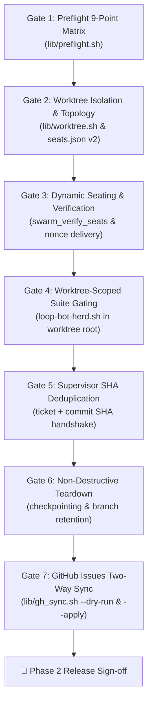

# Phase 2 Worktree Swarm: Release & Synchronization Verification Checklist

**Date:** 2026-09-19 · **Status:** Active Release Gate · **Agent:** `agy-gh`  
**Parent Map:** [`maps/universal-herdr-swarm.md`](../../maps/universal-herdr-swarm.md)  
**Associated Architecture:**  
- [ADR 0006: Git Worktree Worker Isolation](../adr/0006-git-worktree-worker-isolation.md)  
- [Phase 2 Architecture Specification (`docs/worktree-swarm.md`)](../worktree-swarm.md)  
- [GitHub Issues Two-Way Synchronization Protocol (`docs/findings/github-issues-sync.md`)](github-issues-sync.md)  
- [GitHub Issues Sync Tooling (`lib/gh_sync.sh`)](../../lib/gh_sync.sh)  
- [Worktree Lifecycle Library (`lib/worktree.sh`)](../../lib/worktree.sh)

---

## 1. Executive Overview

Milestone 1 established a project-agnostic, sequential multi-agent swarm orchestrator (`up · watch · down · status · verify`) operating inside a dedicated Herdr workspace.

**Phase 2** expands the system into a **concurrent parallel worktree swarm**. Workers operate inside isolated Git worktrees (`.herdr-swarm/worktrees/<seat>`) with dedicated branches (`swarm/<slug>/<seat>`), preventing workspace pollution, index lock contention, and dirty working tree collisions. Concurrently, local architectural decision tickets (`maps/tickets/*.md`) are synchronized bi-directionally with upstream GitHub Issues via [`lib/gh_sync.sh`](../../lib/gh_sync.sh).

This document specifies the **Mandatory Release Verification Checklist** that must be executed and signed off prior to tagging and promoting Phase 2 to production environments.

---

## 2. End-to-End Verification Pipeline

The Phase 2 release gate comprises a sequential, fail-closed verification pipeline:



---

### Gate 1: Preflight 9-Point Matrix Validation

Prior to any workspace creation, pane splitting, or worktree provisioning, the launcher executes the preflight matrix defined in [`lib/preflight.sh`](../../lib/preflight.sh).

* **Command:** `./lib/preflight.sh --json` or `./herdr-loop-swarm.sh preflight`
* **Success Criteria:**
  1. `herdr_daemon`: Responds to `herdr workspace list` within retry limit.
  2. `git_worktree`: Confirms repository is a valid Git worktree (`git rev-parse --is-inside-work-tree`).
  3. `core_jq`: `jq` binary available in `PATH`.
  4. `core_python`: `python3` available, version >= 3.11, `tomllib` importable.
  5. `core_git`: `git` CLI available.
  6. `gh_cli`: GitHub CLI (`gh`) installed.
  7. `gh_auth`: Active authenticated GitHub session (`gh auth status` returns 0).
  8. `repo_slug`: Canonical GitHub remote slug resolved via `lib/profile.sh` `detect_repo` (fail-closed, no kultivait default).
  9. `test_cmd`: Runnable test command detected via `detect_test_cmd` (fail-closed, rejects empty or fake-green `"true"`).
* **Fail-Closed Behavior:** Any error triggers non-zero exit code (`1`) with actionable human remediation hints; execution halts before allocating resources.

---

### Gate 2: Worktree Isolation & Topology

Validates that worker seats execute in isolated Git worktrees rather than the root project repository, per [ADR 0006](../adr/0006-git-worktree-worker-isolation.md).

* **Topology Verification:**
  - **Root Workspace (`$TARGET_DIR`):** Hosts orchestrator (`looper`), strategic overseer (`pm`), and telemetry streaming pane (`lib/telemetry.py`). Checked out on the base branch (`main`).
  - **Worker Worktrees:** Provisioned under `${TARGET_DIR}/.herdr-swarm/worktrees/<seat>`.
  - **Branch Namespacing:** Worker branches conform to `swarm/<slug>/<seat>`.
* **Verification Checks:**
  1. `worktree_provision "$seat" "$slug" HEAD "$TARGET_DIR"` creates directory `.herdr-swarm/worktrees/<seat>`.
  2. `git worktree list --porcelain` indicates the worktree is locked with reason `seated: <seat>` (protecting against automatic external `git worktree prune`).
  3. `.herdr-swarm/seats.json` serializes ledger v2 schema:
     ```json
     {
       "workspace_id": "wM",
       "version": 2,
       "seats": [
         {
           "name": "arch-loop-bot",
           "kind": "opencode",
           "pane": "wM:p3",
           "worktree_dir": "/path/to/loop-bot-herd-agy/.herdr-swarm/worktrees/arch",
           "branch": "swarm/loop-bot/arch"
         }
       ]
     }
     ```
  4. Pane creation (`split_pane`) passes `worktree_dir` as `CWD`, so the worker agent shell physically initializes inside the isolated checkout.

---

### Gate 3: Dynamic Seating & Seat Verification Protocol

Validates that all configured agents initialize cleanly, reach `idle` status, and acknowledge their brief before any autonomous loops begin.

* **Command:** `./herdr-loop-swarm.sh verify [TARGET_DIR]`
* **Verification Checks:**
  1. Inspects `.herdr-swarm/seats.json` v2 ledger.
  2. Confirms hosting panes exist in Herdr and processes are alive (`herdr pane inspect`).
  3. Polls agent statuses via `herdr agent list`, confirming all expected seats reach `idle`.
  4. Nonce Brief Delivery: Verifies that brief templates (`briefs/*.in.md`) were rendered into `.herdr-swarm/briefs/<seat>.md` with all template variables (`{{REPO}}`, `{{TEST_CMD}}`, `{{SLUG}}`) properly substituted.
  5. Timeout & Rollback: If any seat hangs or crashes during startup, the launcher logs the failure, reports partial herd state, and halts rather than proceeding into unmonitored execution.

---

### Gate 4: Worktree-Scoped Suite Gating

Validates that the supervisor evaluates code quality and test passes exclusively within the worker's isolated worktree, per [`docs/worktree-swarm.md`](../worktree-swarm.md).

* **Command:** `./loop-bot-herd.sh check-suite`
* **Verification Checks:**
  1. Working Directory Binding: The suite gate executes `TEST_CMD` within the worker's `worktree_dir`, never touching or testing the root working tree.
  2. Fail-Closed Validation: Exit code 0 is mandatory for GREEN verdict (`PASS`). Any non-zero exit code triggers RED verdict (`FAIL`).
  3. Anchored Whole-Line Regex: Verdict parser anchors matching on whole lines (`^PASS:` / `^FAIL:`) to prevent scrollback substring collisions.
  4. Telemetry Recording: Every verdict writes an event to `.herdr-swarm/traces/<session>.jsonl` and records to `.herdr-swarm/verdicts.jsonl`.

---

### Gate 5: Supervisor SHA Deduplication & Re-Verdict Protocol

Validates that the supervisor prevents redundant evaluations while allowing fast recovery on amended commits.

* **Handshake Protocol:**
  - Worker signals completion: `ARCH DONE #<ticket> <commit_sha>`
* **Verification Checks:**
  1. Deduplication Gate: Supervisor checks `.herdr-swarm/verdicts.jsonl` for exact `(ticket, commit_sha)` tuple. If already evaluated, redundant test runs are skipped.
  2. Collision Protection: Verifies exact ticket ID matching (`#23` vs `#230`) using structured regex matching.
  3. Re-Verdict Support: If a ticket fails (RED), the worker pushes an amended or new commit (`ARCH DONE #<ticket> <new_commit_sha>`). The supervisor detects the new SHA immediately and re-executes the suite gate.

---

### Gate 6: Non-Destructive Teardown & Worktree Pruning

Validates that shutting down the swarm cleanly retires panes, checkpoints dirty work, and prunes worktrees without data loss.

* **Command:** `./herdr-loop-swarm.sh down [TARGET_DIR] [-y]`
* **Verification Checks:**
  1. Confirmation Guard: Demands explicit human confirmation unless `-y` is passed.
  2. Selective Pane Retirement: Inspects `.herdr-swarm/seats.json` and closes only panes registered to the swarm. Host terminal panes and unrelated workspaces remain untouched.
  3. Safe Worktree Checkpointing (`worktree_prune` in `lib/worktree.sh`):
     - If dirty tracked changes exist in a worker worktree, checkpoints them using `git add -u` (never `-A` to prevent capturing untracked build noise).
     - Tags checkpoint ref: `swarm/<slug>/<seat>-checkpoint-<timestamp>`.
     - Unlocks worktree: `git worktree unlock "$wt_path"`.
     - Removes worktree directory: `git worktree remove --force "$wt_path"`.
  4. Branch Retention: Confirms that Git branches `swarm/<slug>/<seat>` survive worktree directory deletion, enabling review, PR creation, or branch recovery.
  5. Audit Log Retention: Telemetry traces (`.herdr-swarm/traces/`) and verdict histories are preserved on disk.

---

## 3. GitHub Issues Two-Way Synchronization Validation

Validates integration between local decision tickets in `maps/tickets/*.md` and upstream GitHub Issues via [`lib/gh_sync.sh`](../../lib/gh_sync.sh).

### A. Preflight & Fail-Closed Validation

| Scenario | Command | Expected Outcome | Status |
| :--- | :--- | :--- | :--- |
| **No Git Remote** | `bash lib/gh_sync.sh --dry-run` | Exits 1 with clear diagnostic: `No canonical GitHub repository detected` and remediation hints. | PASS |
| **Unauthenticated `gh`** | `gh auth logout && bash lib/gh_sync.sh --dry-run` | Exits 1: `GitHub CLI is not authenticated` with `gh auth login` hint. | PASS |
| **Missing `gh` CLI** | `PATH=/bin bash lib/gh_sync.sh --dry-run` | Exits 1: `GitHub CLI ('gh') is not installed or not in PATH`. | PASS |
| **Invalid Slug Format** | `bash lib/gh_sync.sh --repo "invalid-slug"` | Exits 1: `Invalid repository slug format: 'invalid-slug'`. | PASS |

### B. Dry-Run (Zero Unconfirmed Writes) Validation

* **Command:** `bash lib/gh_sync.sh --dry-run --repo <OWNER/REPO>`
* **Verification Checks:**
  1. Discovers all markdown tickets in `maps/tickets/*.md`.
  2. Queries remote issues via `gh issue list --repo <OWNER/REPO>`.
  3. Reconciles operations into structured categories:
     - `[CREATE]`: New remote issue for unlinked local tickets.
     - `[LINK]`: Links existing remote issue matching `[T-XXX]` title prefix.
     - `[UPDATE]`: Reconciles status drift (e.g. local `resolved` vs remote `OPEN`).
     - `[IN_SYNC]`: Identical states.
  4. Guarantees **zero unconfirmed writes**: No GitHub API mutating calls are made, and no local files in `maps/tickets/` are modified.
  5. Prints explicit notice: `DRY RUN: No remote GitHub changes or local file writes were executed. Pass --apply to execute.`

### C. Apply & Metadata Persistence Validation

* **Command:** `bash lib/gh_sync.sh --apply --repo <OWNER/REPO> --ticket <TICKET_ID>`
* **Verification Checks:**
  1. Executes `gh issue create` or `gh issue edit / close / reopen`.
  2. Updates local ticket YAML frontmatter atomically:
     - Adds `github_issue: <int>`.
     - Adds `github_url: "<url>"`.
     - Adds `synced_at: "<iso8601_utc>"`.
  3. Preserves all existing frontmatter keys, comments, and markdown body without corruption.

### D. External PR & Pull Reconciliation

* **Command:** `bash lib/gh_sync.sh --apply --direction both --repo <OWNER/REPO>`
* **Verification Checks:**
  1. Remote Closure Detection: When an issue is closed on GitHub (e.g. via merged PR `Closes #<num>`), pull reconciliation updates local ticket `status: resolved`.
  2. External Ticket Import: If a remote issue with label `swarm:ticket` exists on GitHub without a local counterpart, a corresponding ticket is imported into `maps/tickets/`.

---

## 4. Release Verification Checklist Matrix

| # | Gate / Verification Step | Target Script / Artifact | Test Command | Acceptance Criteria | Sign-off |
| :---: | :--- | :--- | :--- | :--- | :---: |
| 1 | **Code Quality & ShellCheck** | All shell libraries | `shellcheck lib/*.sh herdr-loop-swarm.sh` | 0 warnings across all scripts | [ ] |
| 2 | **Preflight 9-Point Matrix** | `lib/preflight.sh` | `./lib/preflight.sh` | All 9 checks pass; exit 0 | [ ] |
| 3 | **Fail-Closed Remote Policy** | `lib/gh_sync.sh` | `bash lib/gh_sync.sh --dry-run` | Exits 1 on unattached repo | [ ] |
| 4 | **Dry-Run Sync Inspection** | `lib/gh_sync.sh` | `bash lib/gh_sync.sh --dry-run --repo <REPO>` | Generates plan; 0 writes | [ ] |
| 5 | **Worktree Provisioning** | `lib/worktree.sh` | `bash -c 'source lib/worktree.sh && worktree_provision arch test HEAD'` | Worktree created & locked | [ ] |
| 6 | **Seats Ledger v2 Serialization** | `herdr-loop-swarm.sh` | `./herdr-loop-swarm.sh up [dir] --plan` | `seats.json` includes `worktree_dir` | [ ] |
| 7 | **Seat Verification Protocol** | `lib/lifecycle.sh` | `./herdr-loop-swarm.sh verify [dir]` | All seats verified idle | [ ] |
| 8 | **Worktree Suite Gate** | `loop-bot-herd.sh` | `./loop-bot-herd.sh check-suite` | Runs inside worktree; evaluates test | [ ] |
| 9 | **SHA Deduplication Handshake**| `loop-bot-herd.sh` | Check `.herdr-swarm/verdicts.jsonl` | `(ticket, sha)` dedupe verified | [ ] |
| 10| **Safe Worktree Prune & Teardown**| `lib/worktree.sh` | `./herdr-loop-swarm.sh down [dir] -y` | Clean teardown; checkpoint ref saved | [ ] |
| 11| **Live Telemetry ANSI Stream** | `lib/telemetry.py` | View Ops Pane stream | Real-time ANSI badges streaming | [ ] |

---

## 5. Promotion Sign-off Protocol

When all 11 checklist gates achieve `PASS`:

1. **Human Driver Verification:** The human driver reviews dry-run sync results and suite gate pass rates.
2. **Git Baseline Tagging:** Create release commit and tag:
   ```bash
   git tag -a v0.2.0-phase2 -m "release: Phase 2 Universal Worktree Swarm (v0.2.0)"
   ```
3. **Issue Sync Promotion:** Execute final issue synchronization:
   ```bash
   ./lib/gh_sync.sh --apply --repo <OWNER/REPO>
   ```
4. **Live Swarm Activation:** Launch production swarm with worktree isolation enabled.
