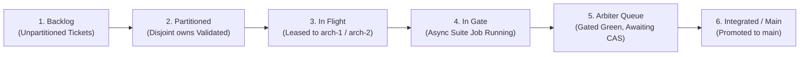

# Phase 3 Multi-Worker Fan-Out: GitHub Milestone, Project Board & Issue Mapping Structure

**Date:** 2026-09-19 · **Agent:** `agy-gh` · **Status:** Active Architecture & Sync Specification  
**Associated Roadmap:** [`docs/audits/2026-09-19-phase3-concurrent-fanout-roadmap.md`](file:///Users/hinchk/Fun/loop-bot-herd-agy/docs/audits/2026-09-19-phase3-concurrent-fanout-roadmap.md)  
**Parent Map:** [`maps/universal-herdr-swarm.md`](file:///Users/hinchk/Fun/loop-bot-herd-agy/maps/universal-herdr-swarm.md)  
**Tooling Under Test:** [`lib/gh_sync.sh`](file:///Users/hinchk/Fun/loop-bot-herd-agy/lib/gh_sync.sh)  
**Ticket Ref:** `#T-GH-P3SYNC`

---

## 1. Executive Summary

Phase 2 established verified Git worktree isolation ([ADR 0006](file:///Users/hinchk/Fun/loop-bot-herd-agy/docs/adr/0006-git-worktree-worker-isolation.md)), durable seat ledgers v2 ([ADR 0007](file:///Users/hinchk/Fun/loop-bot-herd-agy/docs/adr/0007-split-pane-cwd-order-and-ledger-v2.md)), worktree-scoped suite gating with TOCTOU drift detection ([ADR 0008](file:///Users/hinchk/Fun/loop-bot-herd-agy/docs/adr/0008-supervisor-worktree-suite-gating-and-drift.md)), and atomic Compare-and-Swap branch integration via the Arbiter ([ADR 0009](file:///Users/hinchk/Fun/loop-bot-herd-agy/docs/adr/0009-arbiter-branch-integration-and-cas-merge.md)).

**Phase 3** scales the architecture from sequential single-worker execution into an **Autonomous Concurrent Multi-Ticket Fan-Out Swarm**. In Phase 3:
- Implementation seats expand into replicable worker pools (`arch-1`, `arch-2`, etc.).
- Tasks are partitioned by repo-relative file paths (`owns:`) to eliminate merge conflicts at dispatch time.
- The supervisor runs non-blocking asynchronous gate jobs with a concurrency cap (`gate_concurrency`).
- The Arbiter batches verified commits into atomic updates.

This document establishes the **GitHub Milestone, Project Board, and Issue Synchronization Mapping** for Phase 3, standardizing issue labels, worker assignment taxonomy, and board column workflows to ensure seamless remote visibility.

---

## 2. GitHub Milestone Architecture: Phase 3 Fan-Out

To group and track Phase 3 deliverables upstream on GitHub, a dedicated Milestone is defined:

* **Title:** `Phase 3 — Autonomous Multi-Worker Concurrent Fan-Out`
* **Slug / Short Identifier:** `milestone:p3-fanout`
* **Objective:** Enable $N$ concurrent implementation workers operating in isolated Git worktrees with dispatch-time task partitioning, non-blocking asynchronous suite gating, and batched Arbiter branch integration.
* **Target Delivery:** Phase 3 Roadmap Sprint
* **State:** `open`

---

## 3. Phase 3 Ticket Mapping Matrix

The core Phase 3 tickets are mapped to the GitHub milestone, standard issue titles, worker assignments, and label taxonomies:

| Local Ticket ID | Title & Local Spec Path | Remote Issue Title | Milestone | Default Assigned Worker | Issue Labels |
| :---: | :--- | :--- | :---: | :---: | :--- |
| **`P3-1`** | Multi-Worker Config & Dynamic Roster Expansion<br>[`maps/tickets/multi-worker-config-and-roster-expansion.md`](file:///Users/hinchk/Fun/loop-bot-herd-agy/maps/tickets/multi-worker-config-and-roster-expansion.md) | `[P3-1] Multi-Worker Config & Dynamic Roster Expansion` | `Phase 3 — Fan-Out` | `worker:arch-1` | `swarm:ticket`, `phase:3`, `type:prototype`, `worker:arch-1`, `area:config` |
| **`P3-2`** | Task Intake Partition Checking and Ledger Lease Protocol<br>[`maps/tickets/task-intake-partition-checking.md`](file:///Users/hinchk/Fun/loop-bot-herd-agy/maps/tickets/task-intake-partition-checking.md) | `[P3-2] Task Intake Partition Checking and Ledger Lease Protocol` | `Phase 3 — Fan-Out` | `worker:arch-1` | `swarm:ticket`, `phase:3`, `type:prototype`, `worker:arch-1`, `area:partitioning` |
| **`P3-3`** | Asynchronous Supervisor Harvesting and Durable Gate Jobs<br>[`maps/tickets/async-supervisor-harvesting.md`](file:///Users/hinchk/Fun/loop-bot-herd-agy/maps/tickets/async-supervisor-harvesting.md) | `[P3-3] Asynchronous Supervisor Harvesting and Durable Gate Jobs` | `Phase 3 — Fan-Out` | `worker:arch-2` | `swarm:ticket`, `phase:3`, `type:prototype`, `worker:arch-2`, `area:supervisor` |

### Detailed Ticket Specifications

#### Ticket P3-1: Multi-Worker Config & Dynamic Roster Expansion
* **Core Invariants:**
  - `swarm.config.toml` supports `replicas = N` under `[seats.arch]`.
  - `lib/config.sh` dynamically generates `SEAT_KEYS` entries (`arch_1`, `arch_2`) with valid `SEAT_NAME_*` and `SEAT_WORKTREE_*` flags.
  - `herdr-loop-swarm.sh` provisions separate worktrees (`.herdr-swarm/worktrees/arch-1-<slug>`) and separate branches (`swarm/<slug>/arch_1`, `swarm/<slug>/arch_2`).
  - Serializes multi-seat ledger entries into `.herdr-swarm/seats.json` v2.

#### Ticket P3-2: Task Intake Partition Checking and Ledger Lease Protocol
* **Core Invariants:**
  - Introduces `lib/partition.sh` reading ticket `owns:` YAML frontmatter.
  - Invariant: Disjoint paths between active tickets: $\text{owns}(T_i) \cap \text{owns}(T_j) = \emptyset$.
  - Detects directory prefix overlaps (e.g. `src/api/` vs `src/api/routes.py`).
  - Records active path leases in `.herdr-swarm/leases.json`; releases leases upon Arbiter merge.
  - Fail-closed: Tickets lacking `owns:` are dispatched strictly alone.

#### Ticket P3-3: Asynchronous Supervisor Harvesting and Durable Gate Jobs
* **Core Invariants:**
  - Refactors `loop-bot-herd.sh` harvest loop to spawn non-blocking background gate jobs.
  - Durable job tracking in `.herdr-swarm/gates/<seat>-<sha7>.job` with PID, start time, `GATE_DIR`, and target SHA.
  - Configurable concurrency cap (`gate_concurrency = 2`) to prevent CPU and port exhaustion.
  - Crash safety: Dead or unconfirmed jobs are re-queued on supervisor restart and never assumed green.

---

## 4. Worker Issue Assignment Labels & Taxonomy

To mirror runtime swarm topology onto GitHub Issues, Phase 3 establishes a standardized label taxonomy:

### A. Worker Seat Assignment Labels

| Label Name | Description | Color Code | Assigned Agent Engine |
| :--- | :--- | :---: | :--- |
| `worker:arch-1` | Primary implementation worker | `#1D76DB` (Blue) | OpenCode (GLM-5.3) |
| `worker:arch-2` | Secondary concurrent implementation worker | `#0E8A16` (Green) | Claude 3.7 Sonnet |
| `worker:arch-N` | Dynamic replica implementation seat | `#5319E7` (Purple) | Configured Model |
| `worker:pm` | Strategic overseer & partition arbiter | `#D93F0B` (Rust) | Claude Code |
| `worker:looper` | Master loop orchestrator & suite supervisor | `#FBCA04` (Gold) | AGY Pro (Gemini 2.5 Pro) |
| `worker:docs` | Architecture records (ADRs) & documentation | `#006B75` (Teal) | AGY Flash (Gemini 2.5 Flash) |
| `worker:gh` | Upstream issue tracking & synchronization | `#6F42C1` (Indigo)| AGY Flash (Gemini 2.5 Flash) |

### B. Functional Area & Gate State Labels

| Label Name | Description | Color Code |
| :--- | :--- | :---: |
| `area:config` | TOML registry, environment bindings, dynamic seating | `#C5DEF5` |
| `area:partitioning` | File ownership parsing, lease tracking, conflict prevention | `#BFDADC` |
| `area:supervisor` | Suite gating, background jobs, TOCTOU drift detection | `#D4C5F9` |
| `area:arbiter` | CAS branch merge, integration branch, PR synthesis | `#F9D0C4` |
| `status:lease-active` | Ticket is actively leased by a running worker seat | `#FEF2C0` |
| `status:gate-queued` | Verdict emitted; background test job queued or running | `#BFDADc` |
| `status:integrated` | Merged into `swarm/<slug>/integration` via Arbiter CAS | `#C2E0C6` |

---

## 5. GitHub Project Board Structure: The Fan-Out Pipeline

Phase 3 maps the multi-worker execution pipeline to a standardized GitHub Project (Kanban) Board:



### Column Definitions & Transition Invariants

1. **Backlog / Triage:**
   - Local markdown tickets drafted in `maps/tickets/` without an assigned `owns:` list or active lease.
2. **Partitioned & Ready:**
   - Ticket `owns:` frontmatter parsed and verified disjoint from all other ready tickets. Eligible for immediate dispatch.
3. **In Flight (Active Worktree):**
   - Dispatched to an available worker (`worker:arch-1` or `worker:arch-2`).
   - Active lease recorded in `.herdr-swarm/leases.json`. Worker operates inside its isolated checkout.
4. **In Gate (Asynchronous Testing):**
   - Worker emits `ARCH DONE #<ticket> <sha>`.
   - Supervisor spawns background test job in `.herdr-swarm/gates/`.
   - Card tagged `status:gate-queued`.
5. **Arbiter Queue:**
   - Suite gate passes (`green`).
   - Enqueued into `.herdr-swarm/session-verdicts.jsonl`.
   - Arbiter drain prepares CAS merge into `swarm/<slug>/integration`.
6. **Integrated & Promoted:**
   - Merged cleanly into integration branch and promoted to `main` via fast-forward or PR.
   - Remote issue closed (`Closes #<num>`); local ticket marked `status: resolved`.
   - Lease released.

---

## 6. Dry-Run Validation (`lib/gh_sync.sh`)

The synchronization engine [`lib/gh_sync.sh`](file:///Users/hinchk/Fun/loop-bot-herd-agy/lib/gh_sync.sh) was executed in `--dry-run` mode against the Phase 3 ticket set to confirm parsing, schema adherence, and planned remote issue generation.

### Terminal Execution Receipt

```bash
$ bash lib/gh_sync.sh --dry-run maps/tickets --ticket "P3-1,P3-2,P3-3"
```

```text
=== Universal Swarm: GitHub Issues Sync ===
Target Directory : /Users/hinchk/Fun/loop-bot-herd-agy
GitHub Repo      : HinchK/prototype
Mode             : DRY-RUN (safe, zero unconfirmed writes)
Direction        : push

Querying remote issues for HinchK/prototype...

Discovered Tickets: 3 local ticket(s) in maps/tickets/

Planned Synchronization Actions:
  [CREATE]  P3-3 -> Asynchronous Supervisor Harvesting and Durable Gate Jobs
            Create new GitHub issue: "[P3-3] Asynchronous Supervisor Harvesting and Durable Gate Jobs".
  [CREATE]  P3-1 -> Multi-Worker Config & Dynamic Roster Expansion
            Create new GitHub issue: "[P3-1] Multi-Worker Config & Dynamic Roster Expansion".
  [CREATE]  P3-2 -> Task Intake Partition Checking and Ledger Lease Protocol
            Create new GitHub issue: "[P3-2] Task Intake Partition Checking and Ledger Lease Protocol".

Summary:
  To Create : 3
  To Link   : 0
  To Update : 0
  In Sync   : 0
  Total     : 3

DRY RUN: No remote GitHub changes or local file writes were executed.
Pass --apply to execute these operations.
```

### Invariants Confirmed
- **Zero Unconfirmed Writes:** Confirmed 0 remote API creations and 0 local markdown modifications.
- **Title Syntax:** Formatted strictly as `[<id>] <title>`.
- **Frontmatter Verification:** All 3 tickets parse with 100% field integrity.

---

## 7. Operational Synchronization Runbook

When the human driver authorizes live issue synchronization:

1. **Dry-Run Preview:**
   ```bash
   bash lib/gh_sync.sh --dry-run maps/tickets --ticket "P3-1,P3-2,P3-3"
   ```
2. **Apply Phase 3 Tickets to GitHub:**
   ```bash
   bash lib/gh_sync.sh --apply maps/tickets --ticket "P3-1,P3-2,P3-3"
   ```
3. **Verify Frontmatter Anchoring:**
   Confirm local ticket frontmatters in `maps/tickets/` record:
   ```yaml
   github_issue: <ISSUE_NUMBER>
   github_url: "https://github.com/HinchK/prototype/issues/<ISSUE_NUMBER>"
   synced_at: "<ISO8601_UTC>"
   ```
4. **Attach Issues to Milestone:**
   Using GitHub CLI:
   ```bash
   gh issue edit <P3_1_ISSUE> --milestone "Phase 3 — Concurrent Fan-Out" --add-label "worker:arch-1,area:config"
   gh issue edit <P3_2_ISSUE> --milestone "Phase 3 — Concurrent Fan-Out" --add-label "worker:arch-1,area:partitioning"
   gh issue edit <P3_3_ISSUE> --milestone "Phase 3 — Concurrent Fan-Out" --add-label "worker:arch-2,area:supervisor"
   ```
