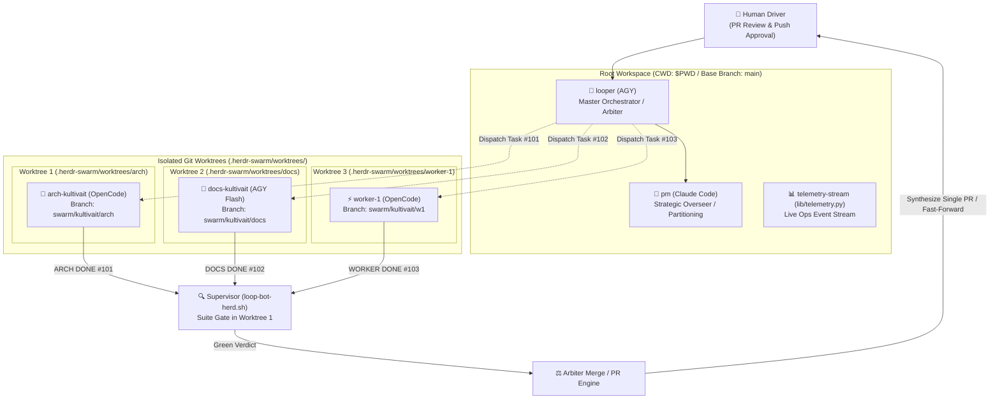

# Phase 2 Architecture Specification: Git Worktree Parallel Worker Isolation

> **Status:** Draft / Accepted for Phase 2  
> **Author:** `agy-docs`  
> **Associated Decision Record:** [ADR 0006: Git Worktree Worker Isolation and Lifecycle Management](adr/0006-git-worktree-worker-isolation.md)  
> **Master Roadmap:** [Wayfinder Map: Universal Herdr Swarm](../maps/universal-herdr-swarm.md)  
> **Reference Prototype:** `loop-bot-herd-claude/herdr-loop-claude-pm.sh` (external lineage — not part of this repo)

---

## 1. Executive Summary

Milestone 1 established the foundations, profile detection, fail-closed test gating, slug namespacing, and safe workspace lifecycle for a single sequential herd. In Milestone 1, all agents operate in the root repository checkout (`$PWD`) on a single branch.

**Phase 2** evolves the swarm from sequential execution into a **concurrent, parallel worker swarm**. Using native `git worktree` isolation, multiple worker agents (`arch`, `worker-docs`, parallel code sub-agents) work simultaneously on independent tasks without file collisions, branch switching conflicts, or Git lock contention. 

Completed worktree branches are independently verified via the Suite Gate within their respective worktree environments and promoted to the base branch through an arbiter integration pipeline.

---

## 2. System Architecture & Topology



### Topology Principles:
1. **Root Anchors**: The orchestrator (`looper`), strategic supervisor (`pm`), and telemetry ops pane remain in `$PWD` on the primary baseline branch (`main`).
2. **Worker Isolation**: Every autonomous coding or documentation agent receives an isolated working directory under `.herdr-swarm/worktrees/<seat>` mapped to an isolated Git branch (`swarm/<slug>/<seat>`).
3. **Common Object Store**: All worktrees share the primary `.git/` object database. No full clones or duplicate histories are created.

---

## 3. Worktree Provisioning and Seating Protocol

Worktrees are managed programmatically by `lib/worktree.sh` during the swarm seating lifecycle:

```bash
# Provisioning workflow per isolated seat
provision_worker_worktree() {
  local target_dir="$1"
  local slug="$2"
  local seat="$3"
  local base_branch="$4"

  local wt_dir="${target_dir}/.herdr-swarm/worktrees/${seat}"
  local branch="swarm/${slug}/${seat}"

  mkdir -p "$(dirname "$wt_dir")"

  # Create branch and attach worktree if absent
  if git -C "$target_dir" show-ref --verify --quiet "refs/heads/${branch}"; then
    git -C "$target_dir" worktree add -q "$wt_dir" "$branch"
  else
    git -C "$target_dir" worktree add -q -b "$branch" "$wt_dir" "$base_branch"
  fi

  # Symlink or bootstrap local dependencies if required by ecosystem
  bootstrap_worktree_dependencies "$target_dir" "$wt_dir"

  printf '%s\n' "$wt_dir"
}
```

### Ecosystem Dependency Bootstrapping
Certain language toolchains expect local cache directories or virtualenvs:
- **Node.js**: Symlink `node_modules` from root (`ln -s "$target_dir/node_modules" "$wt_dir/node_modules"`) if package manifests match, or leverage `pnpm` store.
- **Python**: Configure virtual environment path inheritance via `VIRTUAL_ENV="$target_dir/.venv"`.
- **Rust / Go**: Native compiler caches (`CARGO_TARGET_DIR`, `GOCACHE`) are shared globally and require no in-tree duplication.

---

## 4. Task Partitioning and File Ownership Invariant

Parallel agents must never attempt to modify the same file concurrently. The Phase 2 swarm introduces **File Ownership Partitioning**:

### A. Partition Contract
Tasks dispatched to parallel workers must explicitly specify file ownership boundaries:
```
# Format: <ticket_id> | <tier> | <owns (space-separated paths)> | <task_prompt>
T-101 | code | src/core/engine.py tests/test_engine.py | Implement event dispatcher
T-102 | docs | docs/adr/ docs/spec.md                  | Author architectural documentation
T-103 | code | src/api/routes.py tests/test_routes.py   | Add health check endpoint
```

### B. Partition Invariant Check
Prior to launching parallel worktrees, `lib/worktree.sh` runs `partition_check`:
- Iterates over all active tasks.
- Verifies that the intersection of owned paths across any two tasks is empty:
  $$\text{owns}(T_i) \cap \text{owns}(T_j) = \emptyset \quad \forall i \neq j$$
- If a path collision is detected, the launcher halts and warns the operator to decompose the tasks into sequential milestones.

---

## 5. Durable State Accounting (`seats.json`)

To preserve idempotent lifecycle management, `.herdr-swarm/seats.json` (introduced in [ADR 0004](adr/0004-safe-workspace-lifecycle-and-seat-ledger.md)) is extended with worktree and branch metadata:

```json
{
  "workspace_id": "wM",
  "base_branch": "main",
  "created_at": 1726728000,
  "seats": [
    {
      "name": "looper-kultivait",
      "kind": "agy",
      "pane": "wM:p1",
      "worktree_dir": "/path/to/target-repo",
      "branch": "main",
      "isolated": false
    },
    {
      "name": "arch-kultivait",
      "kind": "opencode",
      "pane": "wM:p2",
      "worktree_dir": "/path/to/target-repo/.herdr-swarm/worktrees/arch-kultivait",
      "branch": "swarm/kultivait/arch",
      "isolated": true,
      "task_id": "T-101",
      "status": "running"
    },
    {
      "name": "worker-docs-kultivait",
      "kind": "agy",
      "pane": "wM:p4",
      "worktree_dir": "/path/to/target-repo/.herdr-swarm/worktrees/worker-docs-kultivait",
      "branch": "swarm/kultivait/docs",
      "isolated": true,
      "task_id": "T-102",
      "status": "running"
    }
  ]
}
```

---

## 6. Independent Suite Gate in Worktree Context

The supervisor daemon ([`loop-bot-herd.sh`](../loop-bot-herd.sh)) evaluates each worker independently within that worker's assigned worktree:

1. **Detection**: Worker emits `ARCH DONE #<ticket> <sha>`.
2. **Context Resolution**: The supervisor checks `seats.json` to find the worker's `worktree_dir`.
3. **Suite Gate Execution**:
   ```bash
   (cd "$worktree_dir" && eval "$TEST_CMD")
   ```
4. **Verification Criteria**:
   - Exit code must be `0`.
   - Test count must be non-zero (rejecting false-green passes).
   - Commit SHA must match the worker's declared SHA.
5. **Logging**: The verdict is recorded in `.herdr-swarm/session-verdicts.jsonl` with worktree attribution.

---

## 7. Arbiter Integration and Branch Promotion Protocol

Once a worker's task is verified green, its branch must be promoted into the base branch.

```
[Worker Branch: swarm/slug/seat]
             │
             ▼  (Suite Gate: GREEN)
[Arbiter Review: Diff & Conflict Detection]
             │
      ┌──────┴──────┐
      │             │
(Clean FF / PR)  (Conflict Detected)
      │             │
      ▼             ▼
[Promote to main]  [Rebase or Dispatch Fix Task]
```

### Arbiter Rules:
1. **Clean Integration**: If `git merge-base --is-ancestor main swarm/<slug>/<seat>` holds, fast-forward merge or squash into `main`.
2. **Pull Request Workflow**: When targeting shared or remote repositories, the arbiter creates a GitHub Pull Request via `gh pr create --head "swarm/<slug>/<seat>" --base "$BASE_BRANCH"`.
3. **No Autonomous Push Invariant**: Pushing the base branch or merged PR to remote origins requires explicit human driver confirmation.

---

## 8. Safe Teardown and Garbage Collection (`swarm_down`)

Teardown must be cleanly separated between disposable worktrees and permanent Git history:

1. **Pane Retirement**: Herdr closes the worker's pane.
2. **Worktree Removal**:
   ```bash
   git -C "$TARGET_DIR" worktree remove --force "$worktree_dir" 2>/dev/null || true
   git -C "$TARGET_DIR" worktree prune 2>/dev/null || true
   ```
3. **Branch Preservation**:
   - The local Git branch `swarm/<slug>/<seat>` is **retained**.
   - If a worker completed useful commits that were not yet integrated, the commits remain safely referenced by the branch ref in the local Git repository.
4. **Root Safety**: The root directory (`$TARGET_DIR`) is protected by explicit path assertion and is never targeted by `worktree remove`.

---

## 9. Phased Implementation Roadmap

| Milestone | Deliverable | Primary Assets | Done-Criteria |
|---|---|---|---|
| **Phase 2.1** | Worktree Lifecycle Engine | `lib/worktree.sh` | Clean creation, dependency bootstrap, and force pruning with 0 shellcheck warnings. |
| **Phase 2.2** | Seat Ledger & Launcher Wiring | `herdr-loop-swarm.sh`, `lib/lifecycle.sh` | Support `--worktree` flag; persist `worktree_dir` in `seats.json`; prune during `down`. |
| **Phase 2.3** | Task Partition Checker | `lib/partition.sh` | Validates file ownership sets; rejects overlapping write targets. |
| **Phase 2.4** | Multi-Worktree Supervisor Gate | `loop-bot-herd.sh` | Runs test runner concurrently within target worktree directories; logs per-worktree verdicts. |
| **Phase 2.5** | Arbiter PR & Merge Engine | `lib/arbiter.sh` | Synthesizes verified branches into single coherent PRs or fast-forward merges. |
